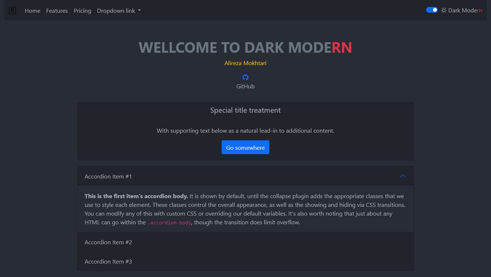

# Dark Mode+rn

## Table of Contents

- [About](#about)
- [Test](#test)
- [Demo](#demo)
- [Usage](#usage)
- [Contributing](../CONTRIBUTING.md)

## About <a name = "about"></a>

If you are a fan of dark theme, this package is what you expected. 

## Test

Tested on Bootstrap version  <= 5

## Demo <a name = "demo"></a>



## Usage <a name = "usage"></a>

1.
`
inatall Bootstrap v5 + bootstrap icon
`

2.

```
<div class="form-check form-switch">
  <input
    class="form-check-input"
    type="checkbox"
    role="switch"
    id="darkmodern"
  />
<label class="form-check-label" for="darkmodern">
  <i class="bi bi-sun"></i>
    Dark Mode<span class="text-danger">rn</span>
</label>
</div>
```

